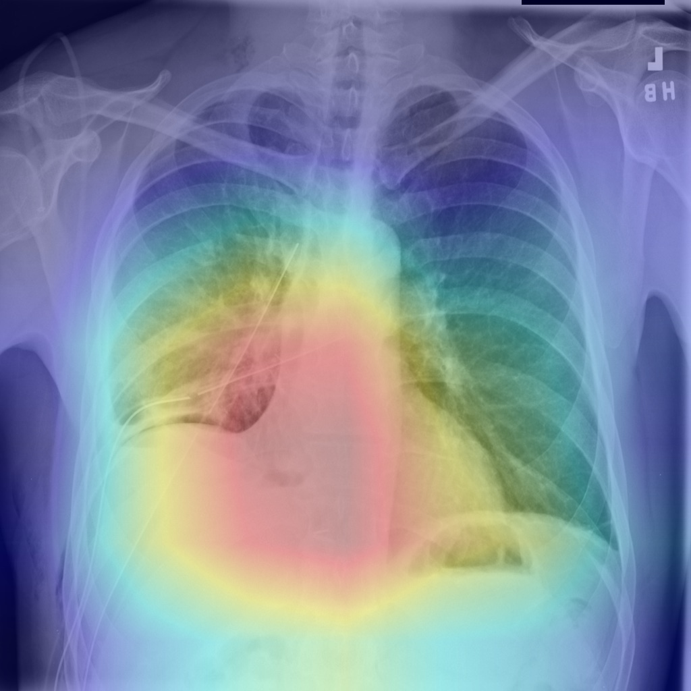

# Explainable deep learning approach for Pneumothorax diagnosis
In this project, we present an approach for pneumothorax classification using deep learning models, specifically VGG-16, ResNet18, ResNet34, ResNet50, and ResNet101. Pneumothorax is a critical medical condition that requires prompt diagnosis to minimize potential complications. To improve the interpretability of our classification results, we employ Gradient-weighted Class Activation Mapping (Grad-CAM) for visualizing the regions of interest in the input images that contribute to the model's decision-making process. We evaluate the performance of the models on a dataset of chest X-ray images and discuss their respective strengths and limitations.
# Requirements
- Python 3.6+
- PyTorch 1.9+
- Torchvision 0.10+
- NumPy
- Matplotlib
- Pillow
- tqdm
- ...
# Dataset
We used the SIIM-ACR Pneumothorax Segmentation dataset from  [Kaggle](https://www.kaggle.com/competitions/siim-acr-pneumothorax-segmentation/data)  for our study. The dataset contains chest X-ray images, with approximately 9,000 healthy cases and 3,600 pneumothorax cases, resulting in a highly imbalanced dataset. To address this imbalance, we balanced the dataset by randomly selecting a subset of healthy cases to create a more equal distribution of classes. Consequently, we used a total of 5,200 cases for the training set, 1,000 cases for the validation set, and 1,000 cases for the testing set. This balanced dataset allowed for a more robust evaluation of the deep learning models' performance in pneumothorax classification.

# Models   
This project uses two deep learning models:

- ResNet18/34/50/101

- VGG16

# Training 
Before run the train, please download the dataset under project folder and change the directory to your local directory.\
Remember split your own dataset into seperate .csv file, like the following directory:
```
├──  project
│    └── tresnet_rain.py
│    └── train_VGG.py
│    └── test_cam.py
│    └── cam_resnet.py
├──  configs  
│    └── train.csv
│    └── test.csv
│    └── valid.csv

```
Train resnet:

```bash
 python tresnet_rain.py
```
Train VGG:

```bash
 python train_VGG.py
```
# Visualization

Visualize by VGG model
```bash
 python test_cam.py
```

Visualize by Resnet model
```bash
 python cam_resnet.py
```

# Results

|Model | Accuracy | Precision| Recall | AUC |
|------|:--------:|:--------:|:--------:|:--------:|
|VGG16 | 86.50%| 86.00% |87.20% |0.9296 |
|ResNet18|  84.40% | 85.39% | 83.00% | 0.9226|
|ResNet34 | 86.10% | 86.61% | 85.40% | 0.9324|
|ResNet50 | 85.80% | 85.66% | 86.00% | 0.9377|
|ResNet101 | 86.70% | 87.22% | 86.00% | 0.9332|

# Example Results of Grad-Cam


From ResNet34\



